# Azure Healthcare Security Landing Zone

### Securing a Healthcare Workload in Azure — From Governance to Detection

A healthcare organization preparing to host a clinical workload in Azure has a problem:

**Development teams need enough access to deploy resources, but sensitive data cannot be publicly exposed, privileged changes must be auditable, and security cannot depend on engineers remembering every requirement.**

I built this Azure landing zone to solve that problem.

Rather than treating the project as a collection of Azure resources, I designed a security boundary around a modeled healthcare workload using **Azure Policy, RBAC, network segmentation, Private Link, customer-managed encryption keys, centralized logging, and KQL-based detection**.

The most valuable part of the project was not getting the resources deployed.

**It was testing whether the security controls actually worked and fixing them when they didn't.**

> **Focus:** Azure Cloud Security | Zero Trust | Governance | Detection Engineering | SOC 2 & HIPAA Security Readiness

---

# The Problem

A healthcare workload introduces several security questions:

- How do we prevent developers from deploying resources outside approved regions?
- How do we enforce governance without relying on manual review?
- How do we prevent unnecessary public access to sensitive services?
- How do we restrict communication between application tiers?
- How do we control access to encryption keys?
- How do we know when someone changes a critical security control?
- How do we prove the controls are actually operating?
- What would still be missing before calling the environment production ready?

The project was designed around answering those questions.

---

# Architecture

The environment used an Azure Management Group hierarchy with separate Development and Production landing-zone scopes.

The Development environment used a **hub-spoke network architecture** with a spoke divided into Web, Application, and Data tiers to model a three-tier healthcare workload.

> **Note:** The Web/App/Data tiers represent the security architecture for a modeled healthcare application. Application compute was not deployed as part of this project.

```text
                    Azure Tenant
                         │
                         ▼
                   Landing-Zones
                    /          \
                   /            \
           Development        Production
                │
                ▼
        Azure Subscription
                │
        ┌───────┴────────┐
        │                │
        ▼                ▼
     Hub VNet ◄──────► Development Spoke
                          │
                 ┌────────┼────────┐
                 ▼        ▼        ▼
                Web      App      Data
                 │        │        │
                 │ 443    │ 1433   │
                 └───────►└───────►│
                                    │
                              Private Endpoints
                                /          \
                               ▼            ▼
                          Key Vault      Storage
                               │
                               ▼
                       Customer-Managed Key

             Azure Activity + Resource Logs
                         │
                         ▼
                   Log Analytics
                         │
                         ▼
                   KQL Detection
```

The design follows a simple principle:

> **Allow the workload to function while reducing unnecessary trust and making security-sensitive activity observable.**

### Management Group Structure

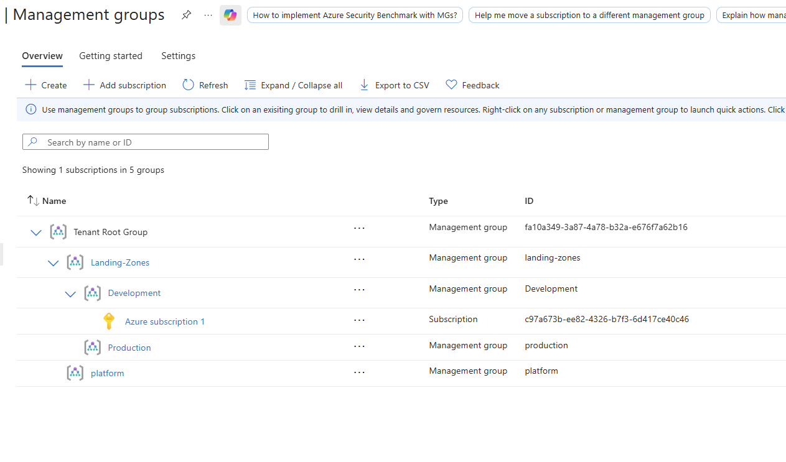

**Evidence:** Management Group hierarchy establishing centralized Landing-Zones governance with separate Development and Production scopes.

---

# 1. Building the Security Boundary

The first objective was preventing insecure cloud deployments before they happened.

Instead of relying on engineers to remember security standards, I used **Azure Management Groups and Azure Policy** to enforce controls higher in the Azure hierarchy.

Two primary preventive controls were implemented:

- Resources must use an approved Azure region.
- Supported workload resources must contain an `Environment` tag.

Approved deployment regions were limited to:

```text
East US
East US 2
```

## Testing the Guardrails

I did not treat a successfully assigned Azure Policy as proof that the control worked.

I deliberately attempted deployments that violated the policies.

### Unauthorized Region Test

A Storage Account deployment was attempted in **West US 2**.

Azure Policy denied the deployment.

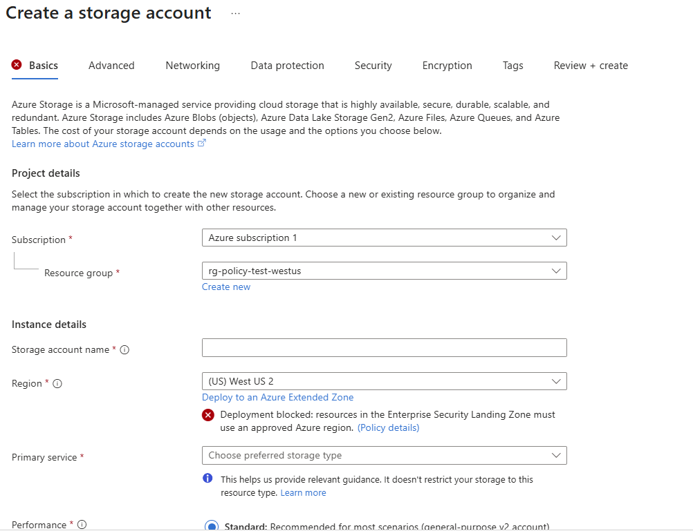

**Result:** Workloads could not be deployed outside the organization's approved Azure regions.

### Missing Tag Test

A second deployment was attempted without the required `Environment` tag.

Azure returned:

```text
RequestDisallowedByPolicy
```

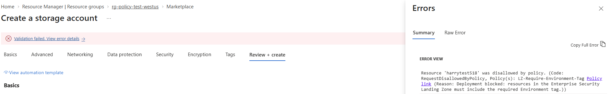

**Result:** Governance was enforced by Azure rather than depending on manual review.

---

# 2. Separating Access and Network Trust

Preventing bad deployments was only one part of the problem.

The environment also needed boundaries around **who could administer resources** and **which network tiers could communicate**.

## Identity and RBAC

Azure RBAC was used to separate workload administration from security responsibilities.

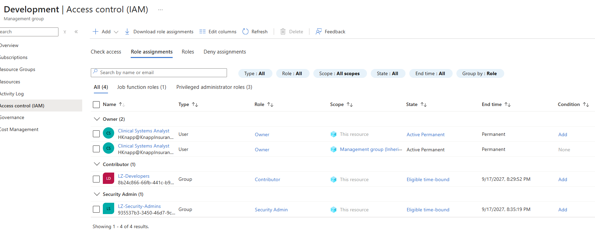

**Evidence:** Development RBAC configuration demonstrating separation between workload and security responsibilities.

The lab also exposed an important production-hardening opportunity: standing privileged access should be minimized.

In a production environment, I would further reduce standing administrative privileges through **Microsoft Entra Privileged Identity Management (PIM), just-in-time elevation, approval workflows, and periodic access reviews** where licensing and operational requirements permit.

---

## Network Segmentation

The Development spoke was divided into three security zones:

| Tier | Subnet | Intended Access |
|---|---|---|
| Web | `snet-web` | HTTPS entry tier |
| Application | `snet-app` | HTTPS from Web tier |
| Data | `snet-data` | SQL from Application tier |

The intended application flow was:

```text
Internet
   │
   │ HTTPS 443
   ▼
 Web Tier
   │
   │ HTTPS 443
   ▼
 App Tier
   │
   │ SQL 1433
   ▼
 Data Tier
```

Dedicated NSGs were applied to the tiers rather than allowing unrestricted east-west communication.

The Data tier, for example, allowed SQL traffic from the Application subnet and explicitly denied other VNet inbound traffic.

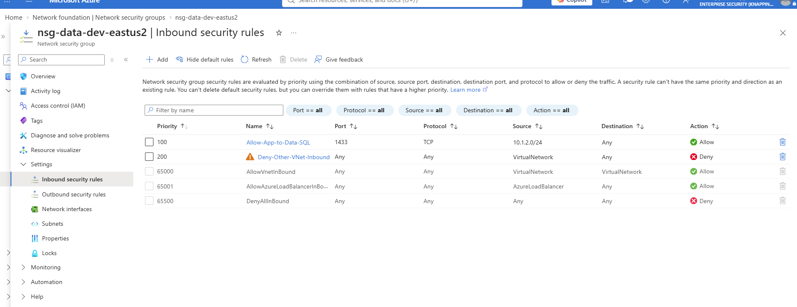

**Evidence:** Data-tier NSG allowing the modeled Application tier to reach SQL/1433 while denying other VNet inbound traffic.

The spoke was connected to the hub using VNet peering.

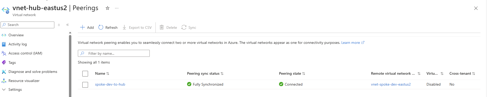

**Evidence:** Connected and synchronized hub-spoke VNet peering.

---

# 3. Protecting Sensitive Healthcare Data

A healthcare workload should not expose sensitive storage and cryptographic services to the public internet simply because Azure supports public endpoints.

The next objective was therefore:

> **Keep sensitive services private and tightly control how encryption keys are accessed.**

## Private Connectivity

Azure Private Link was configured for sensitive PaaS services.

Implemented controls included:

- Storage Private Endpoint
- Key Vault Private Endpoint
- Private DNS
- Private Endpoint placement in the protected Data subnet
- Public network access disabled for Storage

The Storage Private Endpoint was successfully approved:

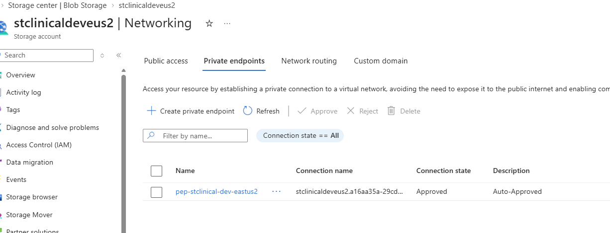

Private DNS mapped the Storage service to the private endpoint address:

```text
10.1.3.7
```

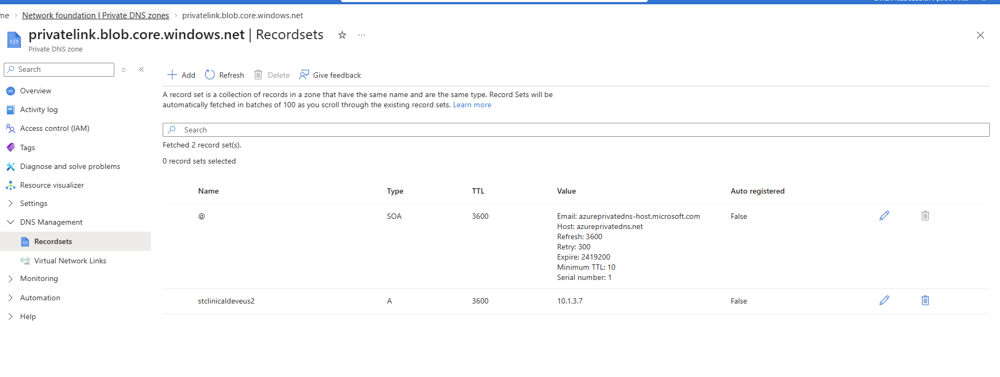

**Result:** The Storage Account could be addressed through private Azure networking rather than requiring public service exposure.

---

## Customer-Managed Encryption

Azure Storage was configured to use a **customer-managed encryption key (CMK)** stored in Azure Key Vault.

The access path was:

```text
Azure Storage
      │
      ▼
User-Assigned Managed Identity
      │
      ▼
Azure Key Vault
      │
      ▼
Customer-Managed RSA Key
```

The Storage Account used a user-assigned managed identity to access the encryption key rather than embedding credentials into an application.

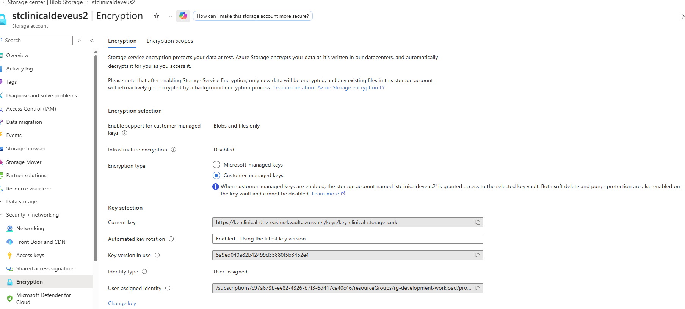

Controls included:

- Customer-managed RSA key
- Azure Key Vault
- User-assigned managed identity
- Azure RBAC authorization
- Key Vault soft delete
- Key Vault purge protection
- Automatic use of the latest key version
- TLS 1.2
- Secure transfer required
- Anonymous Blob access disabled

### Key Vault Protection

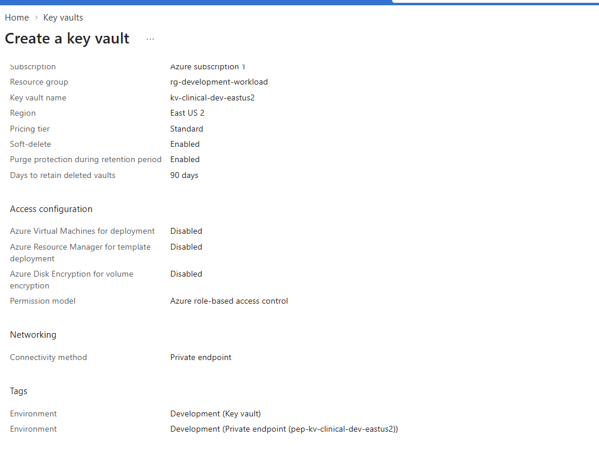

**Evidence:** Key Vault configured with Azure RBAC, soft delete, purge protection, and Private Endpoint connectivity.

---

# 4. When the Security Controls Broke

This became the most useful part of the project.

The original mandatory-tagging policy worked — **too well**.

It was broad enough that Azure-managed dependencies created by Private Link, including Private DNS resources, were evaluated by the tagging requirement.

Those resources could not reliably satisfy the intended tagging behavior.

The result was a security control interfering with required platform functionality.

```text
Tagging Policy
      │
      ▼
Private Link Deployment
      │
      ▼
Azure-Managed Dependency Blocked
      │
      ▼
Root Cause Investigation
      │
      ▼
Policy Redesigned
```

Simply disabling the policy would have restored functionality, but it would also have removed the security requirement.

Instead, I redesigned the control.

The custom policy used `Indexed` mode and excluded Azure resource types that should not be evaluated by the workload tagging requirement.

```json
{
  "mode": "Indexed",
  "policyRule": {
    "if": {
      "allOf": [
        {
          "field": "tags['Environment']",
          "exists": "false"
        },
        {
          "field": "type",
          "notIn": [
            "Microsoft.Network/privateDnsZones",
            "Microsoft.Network/privateDnsZones/virtualNetworkLinks"
          ]
        }
      ]
    },
    "then": {
      "effect": "deny"
    }
  }
}
```

The goal was not to weaken governance.

It was to make the control **precise enough to enforce the security requirement without breaking the platform**.

---

# 5. Finding a Second Problem: Policy Scope Drift

After fixing the policy logic, I reviewed Azure Policy compliance.

The environment reported approximately **91% compliance**.

Rather than treating that number as the final result, I investigated the noncompliant resources.

That investigation revealed another issue.

The custom tagging policy had been assigned at the **subscription scope** instead of the intended **Landing-Zones Management Group**.

As a result, unrelated resources in the subscription were being evaluated by a policy intended specifically for landing-zone workloads.

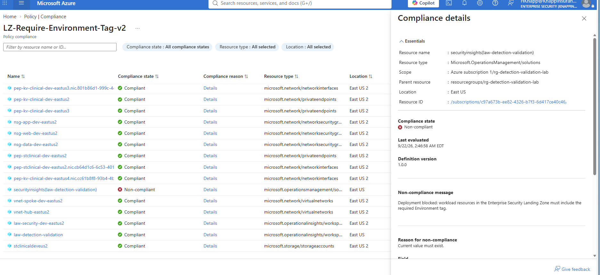

This was a useful reminder that:

> **A correctly written security policy applied at the wrong scope is still a misconfigured security control.**

The overly broad assignment was removed and the policy was reassigned to the correct `Landing-Zones` scope.

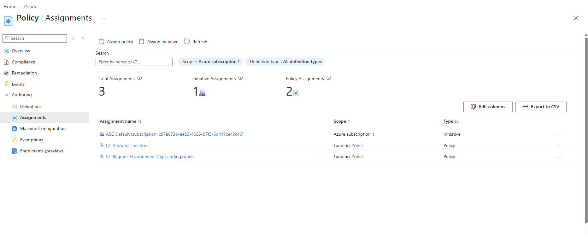

### What this changed

The project moved through a real security-engineering cycle:

```text
Design
  ↓
Implement
  ↓
Test
  ↓
Break
  ↓
Investigate
  ↓
Redesign
  ↓
Validate
```

That process was more valuable than a deployment where every control appeared to work on the first attempt.

---

# 6. Proving the Environment Was Observable

Security controls are difficult to defend if changes to them cannot be reconstructed later.

I centralized Azure security telemetry in:

```text
law-security-dev-eastus2
```

Log sources included:

- Azure Subscription Activity Logs
- Key Vault diagnostic logs
- Storage diagnostic logs

But enabling diagnostic settings was not considered proof that monitoring worked.

I generated administrative activity and searched for the event in Log Analytics.

## End-to-End Logging Validation

```kusto
AzureActivity
| where TimeGenerated > ago(6h)
| project
    TimeGenerated,
    OperationNameValue,
    ActivityStatusValue,
    Caller,
    ResourceGroup,
    ResourceId
| order by TimeGenerated desc
```

The event was successfully ingested.

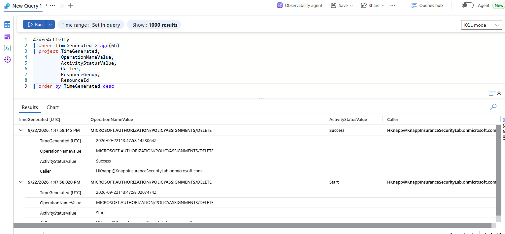

The telemetry captured the:

- initiating identity
- operation
- affected resource
- timestamp
- operation result

This changed the monitoring story from:

**“Logging is enabled.”**

to:

**“I generated an administrative event and proved that the monitoring pipeline captured it.”**

---

# 7. Turning Logs Into Detection

Once the telemetry pipeline was validated, I used KQL to look for changes to critical Azure security controls.

```kusto
AzureActivity
| where TimeGenerated > ago(24h)
| where OperationNameValue has_any (
    "POLICYASSIGNMENTS",
    "ROLEASSIGNMENTS",
    "NETWORKSECURITYGROUPS",
    "VAULTS"
)
| where OperationNameValue has_any (
    "WRITE",
    "DELETE"
)
| project
    TimeGenerated,
    OperationNameValue,
    ActivityStatusValue,
    Caller,
    ResourceGroup,
    ResourceId,
    CallerIpAddress
| order by TimeGenerated desc
```

The query monitors administrative changes involving:

```text
Azure Policy
Azure RBAC
Network Security Groups
Key Vault
```

I validated the logic using an Azure Policy assignment deletion.

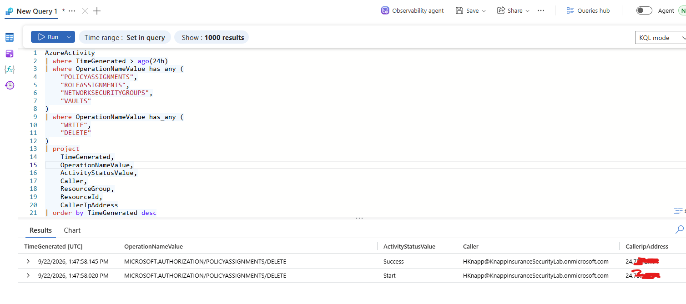

The event exposed:

- who performed the action
- what security control changed
- which resource was affected
- when the action occurred
- whether it succeeded
- the apparent source IP

This provides the foundation for investigating unauthorized or unexpected security-control changes.

A suspicious event could then drive an investigation into:

```text
Security Control Change
        │
        ▼
Identify Actor
        │
        ▼
Review Entra Authentication
        │
        ▼
Validate MFA / Conditional Access
        │
        ▼
Scope Additional Azure Activity
        │
        ▼
Contain if Unauthorized
```

---

# 8. Protecting Against Data Loss

Encryption protects confidentiality, but healthcare environments also need the ability to recover from accidental or malicious changes.

Storage data-protection controls included:

- Blob soft delete — 7 days
- Container soft delete — 7 days
- Blob versioning
- Change Feed logging
- Secure transfer required
- Anonymous Blob access disabled

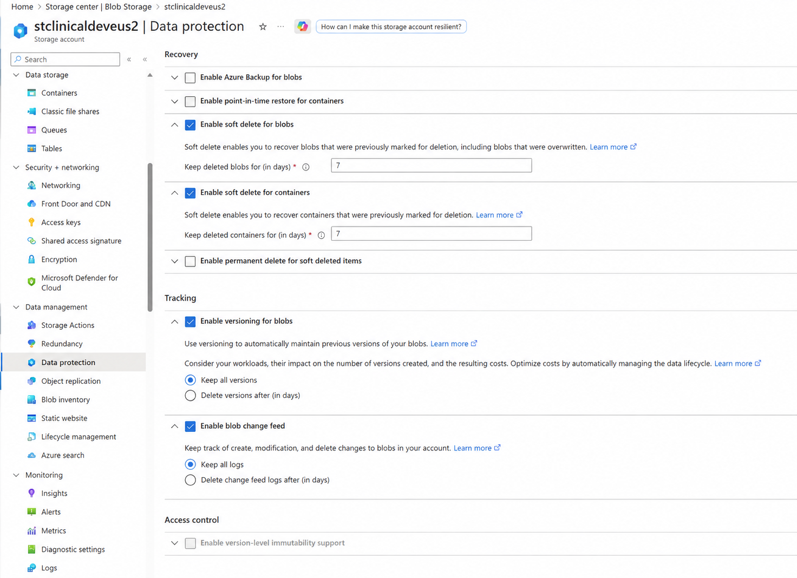

These controls provide recovery and investigation capabilities if data is modified or deleted.

A real production environment would require formal **RPO, RTO, backup retention, and disaster-recovery requirements** based on business and clinical impact.

---

# 9. Would I Call This Production Ready?

**No.**

Building the controls was only part of the exercise.

I also reviewed the environment from the perspective of **SOC 2 Trust Services Criteria and HIPAA Security Rule safeguards** to identify what remained incomplete.

Microsoft Defender for Cloud **Foundational CSPM** was enabled as a cost-controlled posture-management capability.

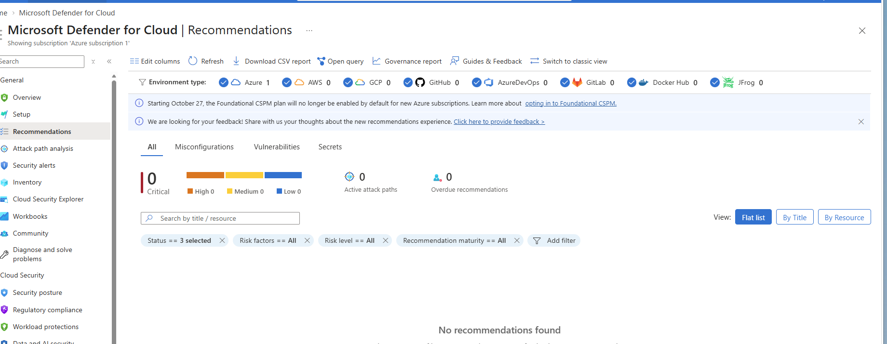

I did not interpret an empty recommendation list as proof that the environment had zero vulnerabilities.

Instead, the assessment considered **coverage, workload visibility, and controls that were not implemented in the lab**.

### Production Hardening Priorities

The assessment identified several areas that would need additional maturity:

| Area | Production Improvement |
|---|---|
| Privileged Access | PIM/JIT elevation and periodic access reviews |
| Vulnerability Management | Continuous scanning, prioritization, remediation SLAs and validation |
| Network Security | Centralized ingress/egress inspection using Azure Firewall or equivalent |
| Storage Authentication | Disable Shared Key where application compatibility permits |
| Recovery | Formal RPO/RTO and backup requirements |
| Incident Response | Documented escalation, ownership and response procedures |
| Compliance | Continuous control monitoring and evidence collection |

These were documented as **known gaps**, rather than enabling expensive services simply to make the lab appear complete.

> This project represents a technical SOC 2/HIPAA **security readiness exercise**. It is not a SOC 2 attestation, HIPAA certification, legal opinion, or independent compliance determination.

---

# What I Learned

# What I Learned

### Testing means trying to break things

One of the biggest things I took away from this project is that I would rather find out something breaks in testing than find out after it reaches production.

I intentionally tried deployments that should fail, changed configurations, tested policy boundaries, and looked for ways the environment could behave differently than I expected.

The goal wasn't just to prove that the happy path worked. It was to ask:

**What happens when someone does something they aren't supposed to do? What happens when a control is applied at the wrong scope? What happens when a security control interferes with a legitimate Azure service?**

Those are problems I want to discover in a safe development environment, not while a production healthcare application is running.

### A security control can work and still be wrong

My tagging policy is a good example.

The policy successfully blocked resources without the required tag, so technically it was doing its job. But it was also interfering with Azure-managed resources that Private Link needed.

That taught me that making something more restrictive doesn't automatically make it more secure.

The control has to protect the environment **without breaking the workload it is supposed to protect**.

### Scope matters just as much as the policy

I also discovered that the tagging policy had been assigned too broadly at the subscription level.

The policy itself wasn't necessarily the problem anymore (where I applied it was).

That reinforced the importance of checking scope, inheritance, and the possible impact on other resources before pushing a control into production.

### Don't assume something works because Azure says it's enabled

I took the same approach with logging.

Instead of stopping after configuring diagnostic settings, I generated administrative activity and then searched for it in Log Analytics.

I wanted to prove the entire path worked:

**Action → Azure Activity Log → Log Analytics → KQL → Investigation**

If I couldn't find the activity when I knew exactly what happened, I wouldn't want to depend on that telemetry during a real security incident.

### Build it, test it, break it, fix it, then validate it again

That became the mindset behind this project.


Build
  ↓
Test
  ↓
Try to Break It
  ↓
Investigate
  ↓
Fix
  ↓
Test Again
---

# Project Result

The final project established a healthcare-focused Azure security foundation that could:

**Prevent**
- unauthorized deployment regions
- missing workload governance tags
- unnecessary public Storage exposure
- unrestricted modeled east-west network access

**Protect**
- sensitive Azure services through Private Link
- Storage encryption keys through Key Vault and managed identity
- recoverable Storage data through versioning and soft delete

**Detect**
- administrative security-control changes through centralized Azure telemetry and KQL

**Validate**
- policy enforcement through negative testing
- telemetry ingestion through generated administrative activity
- governance scope through compliance investigation
- production gaps through a SOC 2/HIPAA security readiness assessment

The environment was **decommissioned after validation and evidence collection** to avoid unnecessary Azure costs.

---

# Repository Structure

```text
Azure-Healthcare-Security-Landing-Zone/
│
├── README.md
│
├── docs/
│   ├── architecture/
│   └── SOC2-HIPAA-Security-Readiness-Assessment.pdf
│
├── evidence/
│   ├── governance/
│   ├── identity/
│   ├── networking/
│   ├── data-protection/
│   └── monitoring/
│
├── policy/
│   └── require-environment-tag.json
│
└── detections/
    └── security-control-change-detection.kql
```

Additional screenshots are retained in the `evidence/` directories so the README can remain focused on the engineering story while still providing supporting implementation evidence.

---

# Next Iteration

This project focused on **cloud security architecture and control validation**.

The next iteration of this work will take the same security principles and implement them through:

```text
Terraform
   ↓
GitHub Actions
   ↓
Secure CI/CD
   ↓
Azure
   ↓
Private Workload
   ↓
Automated Security Testing
   ↓
Cloud Detection & Monitoring
```

That project will focus on **Infrastructure as Code, DevSecOps, workload identity, automated security scanning, container security, and CI/CD security controls** rather than retroactively adding those technologies to this project.

---

# Author

**Harrison Knapp**

Azure Cloud Security | Detection Engineering | Security Operations

GitHub: `hknapp518`

---

## Disclaimer

This project was created as a personal cloud security engineering lab using synthetic resources and data.

The SOC 2 and HIPAA portions represent a technical security readiness exercise and do not constitute a SOC 2 attestation, HIPAA certification, legal opinion, or independent compliance assessment.
