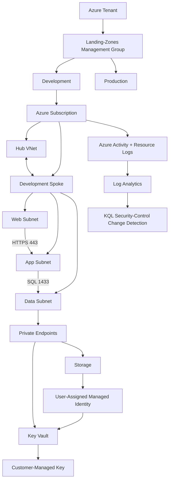

# Azure Healthcare Security Landing Zone

### Secure-by-design Azure foundation for a modeled healthcare workload

A healthcare organization preparing to host a clinical workload in Azure needs more than deployed resources. Development teams need enough access to work, sensitive services should not be unnecessarily public, governance must be enforced consistently, and security-sensitive changes must be auditable.

I built this landing zone to model that problem and, more importantly, to **test whether the controls actually worked**.

> **Focus:** Azure Cloud Security | Zero Trust | Governance | Detection Engineering | SOC 2 & HIPAA Security Readiness  
> **Technologies:** Azure Policy | Entra ID | RBAC | VNets | NSGs | Private Link | Key Vault | Storage | Managed Identity | Log Analytics | Defender for Cloud | KQL

---

## Architecture



> **Scope note:** The Web/App/Data tiers model the security architecture for a healthcare application. Application compute and real patient data were not deployed.


---

## What I Built

The landing zone combined preventive, protective, and detective controls:

- **Governance:** Management Groups and Azure Policy for approved regions and mandatory workload tagging.
- **Identity:** Azure RBAC separating workload and security responsibilities.
- **Network security:** Hub-spoke networking with Web, App, and Data subnet segmentation enforced by NSGs.
- **Private access:** Private Link and Private DNS for sensitive Azure PaaS services.
- **Data protection:** Key Vault, customer-managed encryption, managed identity, TLS 1.2, Storage versioning, and soft delete.
- **Monitoring:** Subscription Activity Logs and resource diagnostics centralized in Log Analytics.
- **Detection logic:** KQL to identify write/delete activity affecting Azure Policy, RBAC, NSGs, and Key Vault.

---

## 1. Preventing Insecure Deployments

Security requirements were enforced through Azure Policy rather than depending on manual review.

Two guardrails were negatively tested:

**Unauthorized region:** I attempted to deploy a Storage Account in **West US 2** while the landing zone allowed only East US and East US 2.


**Missing governance tag:** I attempted a deployment without the required `Environment` tag and received `RequestDisallowedByPolicy`.


**Result:** Both invalid deployments were blocked before resources were created.

---

## 2. Restricting Access and Network Trust

Azure RBAC separated workload administration from security responsibilities.


The Development spoke modeled a three-tier workload:

| Tier | Allowed Flow |
|---|---|
| Web | HTTPS/443 entry tier |
| App | HTTPS/443 from Web |
| Data | SQL/1433 from App |

The Data-tier NSG allowed SQL from the Application subnet and denied other VNet inbound traffic.


The spoke was connected to the hub through synchronized VNet peering.


---

## 3. Protecting Sensitive Data

Azure Storage used a **customer-managed RSA key in Key Vault**. A user-assigned managed identity accessed the key, avoiding embedded credentials.


Storage public network access was disabled and a Private Endpoint was placed in the protected Data subnet.


Private DNS resolved the Storage service to its private endpoint address.


Additional Storage protections included:

- Secure transfer required
- TLS 1.2
- Anonymous Blob access disabled
- Blob and container soft delete
- Blob versioning
- Change Feed logging

---

## 4. The Control That Broke the Platform

The most valuable part of the project was troubleshooting a control that technically worked but was **too broad**.

My original mandatory-tagging policy also evaluated Azure-managed dependencies created by Private Link. Private DNS resources could not reliably satisfy the intended workload-tagging behavior, so the policy interfered with legitimate platform functionality.

Instead of disabling the security requirement, I redesigned it using `Indexed` mode and excluded resource types that should not be evaluated by the workload tagging policy.

```json
{
  "mode": "Indexed",
  "policyRule": {
    "if": {
      "allOf": [
        { "field": "tags['Environment']", "exists": "false" },
        {
          "field": "type",
          "notIn": [
            "Microsoft.Network/privateDnsZones",
            "Microsoft.Network/privateDnsZones/virtualNetworkLinks"
          ]
        }
      ]
    },
    "then": { "effect": "deny" }
  }
}
```

The reusable policy artifact is available here: [require-environment-tag.json](policy/require-environment-tag.json).

### Then I found a second problem

Compliance review showed approximately **91% compliance**. Investigation revealed that the custom policy had been assigned at the subscription instead of the intended Landing-Zones Management Group, causing unrelated subscription resources to be evaluated.


I removed the overly broad assignment, corrected the scope, and validated the landing-zone assignments.


> A correctly written security policy applied at the wrong scope is still a misconfigured security control.

---

## 5. Proving the Monitoring Pipeline Worked

I centralized Subscription Activity Logs plus Key Vault and Storage diagnostic logs in `law-security-dev-eastus2`.

Rather than stopping after enabling diagnostics, I generated administrative activity and verified that it reached Log Analytics.


That validated the path:

```text
Administrative Action → Azure Activity Log → Log Analytics → KQL → Investigation
```

I then developed KQL logic to surface write/delete operations involving Azure Policy, RBAC, NSGs, and Key Vault.


The query was validated using a policy-assignment deletion and returned the actor, operation, affected resource, timestamp, result, and apparent source IP.

[View the KQL detection logic](detections/security-control-change-detection.kql)

> This project validates the **detection logic and telemetry path**. In production, I would operationalize the query through SIEM/alerting workflows, response ownership, and escalation procedures.

---

## 6. Security Readiness Review

I reviewed the environment against relevant **SOC 2 Trust Services Criteria and HIPAA Security Rule safeguard areas** to identify both implemented controls and remaining production gaps.

### Key production gaps

| Area | Production Improvement |
|---|---|
| Privileged Access | PIM/JIT elevation, approvals, and recurring access reviews |
| Vulnerability Management | Continuous scanning, prioritization, remediation SLAs, and validation |
| Network Security | Centralized ingress/egress inspection with Azure Firewall or equivalent |
| Storage Authentication | Disable Shared Key where compatibility permits |
| Recovery | Formal RPO/RTO, backups, and tested recovery procedures |
| Incident Response | Formal ownership, escalation, communications, and exercises |
| Compliance Operations | Continuous control monitoring and evidence retention |

**[View the SOC 2 & HIPAA Security Readiness Assessment](docs/SOC2-HIPAA-Security-Readiness-Assessment.pdf)**

> This is a technical security-readiness exercise, not a SOC 2 attestation, HIPAA certification, legal opinion, or independent compliance determination.

---

## What I Learned

### Testing means trying to break things

I would rather discover a bad assumption, broken dependency, overly broad policy, or missing log during testing than discover it for the first time in production.

This project reinforced three lessons:

- A restrictive control is not automatically a good control if it breaks legitimate platform functionality.
- **Scope and inheritance matter just as much as policy logic.**
- A feature showing as enabled is not proof that it works; generate activity and validate the full path.

```text
Build → Test → Try to Break It → Investigate → Fix → Test Again
```

For me, that's the difference between simply configuring Azure resources and actually engineering a secure environment.

---

## Project Result

The final environment demonstrated the ability to:

**Prevent** insecure deployments through Azure Policy.  
**Restrict** identity and network trust through RBAC, NSGs, and segmentation.  
**Protect** sensitive services through Private Link, Key Vault, managed identity, and CMK encryption.  
**Detect** security-control changes through centralized telemetry and KQL.  
**Validate** controls through negative testing and generated administrative activity.  
**Assess** what remained before a similar environment should be considered production-ready.

The lab was decommissioned after validation and evidence collection to avoid unnecessary Azure costs.

---

## Repository Structure

```text
Azure-Healthcare-Security-Landing-Zone/
│
├── README.md
├── docs/
│   └── SOC2-HIPAA-Security-Readiness-Assessment.pdf
├── evidence/
│   ├── governance/
│   ├── identity/
│   ├── networking/
│   ├── data-protection/
│   └── monitoring/
├── policy/
│   └── require-environment-tag.json
└── detections/
    └── security-control-change-detection.kql
```

---

## Author

**Harrison Knapp**  
Azure Cloud Security | Detection Engineering | Security Operations  
GitHub: `hknapp518`

---

### Disclaimer

This project is a personal cloud-security engineering lab using synthetic resources and data. No real patient information or production healthcare systems were used.
